# Load Balancer Project

## Design Choices

- **load_balancer/**: Contains the load balancer application files.
- **myserver/**: Contains server application files used by the load balancer.
- **testing_code/**: Contains Python files to analyse and test the load balancer.
- **screenshot/**: Contains figures and images for the tested results.
- **docker-compose.yml**: Defines Docker services for load balancer and server instances.
- **Makefile**: Provides convenient commands for Docker operations.
- **Flask**: Chosen for its lightweight and easy-to-use framework for building the load balancer and server applications.
- **Consistent Hashing**: Implemented for server selection based on request characteristics, ensuring distribution of load to the servers.
- **Docker**: Utilized for containerization, ensuring consistent deployment environments across different machines. 
- The containers created and added are in the same network environment for efficient communication e.g dynamic addition and removal of containers.

## Assumptions

- **Single Load Balancer**: The setup assumes a single load balancer instance handling all incoming requests.
- **Request Testing Endpoint**: Assumes testing the load balancer with requests to `http://localhost:5000/home` using different request IDs to verify load balancing functionality.
- Used 10 requests to test the server failure response, for better visual on the terminal.
- **Development Environment**: Designed for development and testing purposes.

## Usage

### Prerequisites

- Docker Version 20.10.23 or above
- Python
- Docker compose
- Ubuntu 20.04 LTS or above

### Docker Installation

Run the following commands to install Docker:

```bash
   sudo apt-get update
   sudo apt-get install ca-certificates curl gnupg lsb-release
   sudo mkdir -p /etc/apt/keyrings
   curl -fsSL https://download.docker.com/linux/ubuntu/gpg | sudo gpg --dearmor -o /etc/apt/keyrings/docker.gpg
   echo "deb [arch=$(dpkg --print-architecture) signed-by=/etc/apt/keyrings/docker.gpg] https://download.docker.com/linux/ubuntu $(lsb_release -cs) stable" | sudo tee /etc/apt/sources.list.d/docker.list > /dev/null
   sudo apt-get update
   sudo apt-get install docker-ce docker-ce-cli containerd.io
```
To install Docker Compose:

```bash
   sudo curl -SL https://github.com/docker/compose/releases/download/v2.15.1/docker-compose-linux-x86_64 -o /usr/local/bin/docker-compose
   sudo chmod +x /usr/local/bin/docker-compose
   sudo ln -s /usr/local/bin/docker-compose /usr/bin/docker-compose
```
### Building and Running

1. **Build Docker Images:**
```bash
   make build 
```
2. **Start Services:**
```bash
   make up
```
3. **Access Load Balancer**
- To check server replicas
```bash
    curl -X GET http://localhost:5000/rep
```
- To check heartbeat for server e.g. server1
```bash
    curl -X GET http://localhost:5001/heartbeat
```
- To add server e.g 3 servers
```bash
    curl -X POST http://localhost:5000/add     -H "Content-Type: application/json"     -d '{"n": 3}'
```
- To remove server e.g 1 server
```bash
   curl -X DELETE http://localhost:5000/rm     -H "Content-Type: application/json"     -d '{"n": 1}'
```
## Testing and Performance Analysis

1. **/rep endpoint `http://localhost:5000/rep`** 

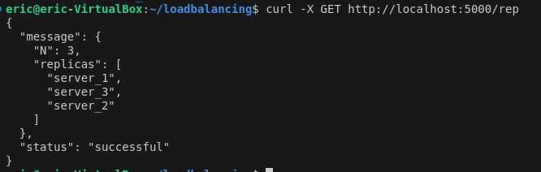

2. **/heartbeat endpoint e.g for server at `http://localhost:5002/hearbeat` server_2**

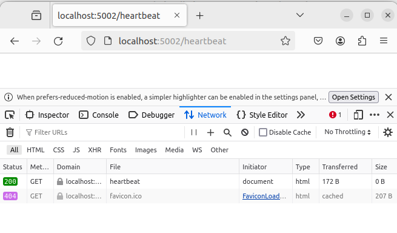

3. **/home endpoint e.g for server at  `http://localhost:5001/home` server_1**

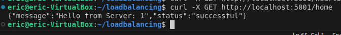

4. **/add endpoint**
- provide the n field and a list of hostnames e.g adding 4:
``` bash
    curl -X POST http://localhost:5000/add -H "Content-Type: application/json" -d '{
    "n": 4,
    "hostnames": ["server_4", "server_5", "server_6", "server_7"]
}'
```


- If no provide hostnames, they are generated automatically based on the number n e.g adding 3 servers:

``` bash
    curl -X POST http://localhost:5000/add -H "Content-Type: application/json" -d '{
    "n": 3
}'
```


- To simulate an *error* where the n field is missing in the JSON payload:

``` bash
    curl -X POST http://localhost:5000/add -H "Content-Type: application/json" -d '{
    "hostnames": ["server_20", "server_21", "server_30"]
}'
```


- confirm the replicas in the server after adding processes


5. **/rem endpoint**
- provide the n field and a list of hostnames to remove e.g. server_1 and server_2:
``` bash
    curl -X DELETE http://localhost:5000/rm -H "Content-Type: application/json" -d '{
    "n": 2,
    "hostnames": ["server_1", "server_2"]
}'
```
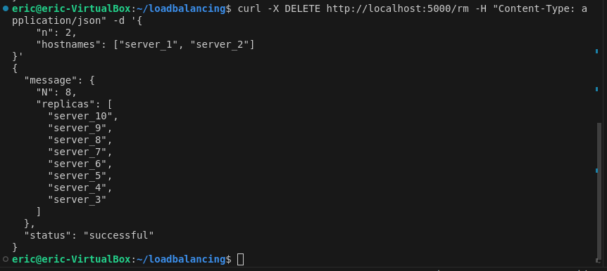

- No hostnames, they should be selected randomly to be removed e.g 3:
``` bash
    curl -X DELETE http://localhost:5000/rm -H "Content-Type: application/json" -d '{
    "n": 3
}'
```
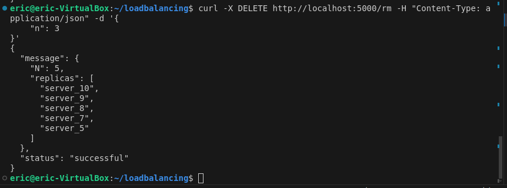

- Simulate an *error* situation where the length of hostnames exceeds n:
``` bash
    curl -X DELETE http://localhost:5000/rm -H "Content-Type: application/json" -d '{
    "n": 2,
    "hostnames": ["server_5", "server_7", "server_8"]
}'

```
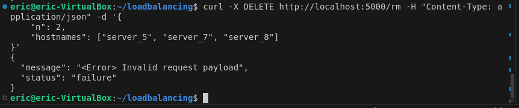

- confirmation of replicas after removing processes

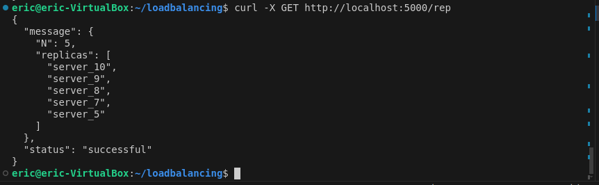

### Testing Load balancing

**A-1 Load Distribution Among 3 Servers**
#### Observations

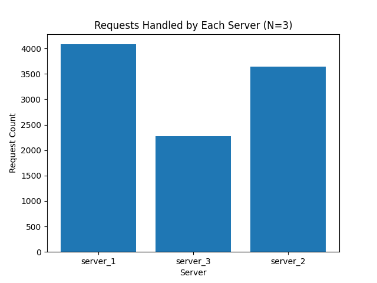

#### Analysis
- The load distribution is uneven, with `server_1` handling the most requests and `server_3` handling the least.
- Possible reasons for this discrepancy could include the network latency, or environmental factors.

**A-2 Scalability with Incrementing Servers N from 2 to 6**
#### Observations


#### Analysis
- The average load per server decreases as the number of servers increases.
- The load balancer scales efficiently with more servers.

**A-3 Load Balancer Recovery from Server Failure**

#### Observations

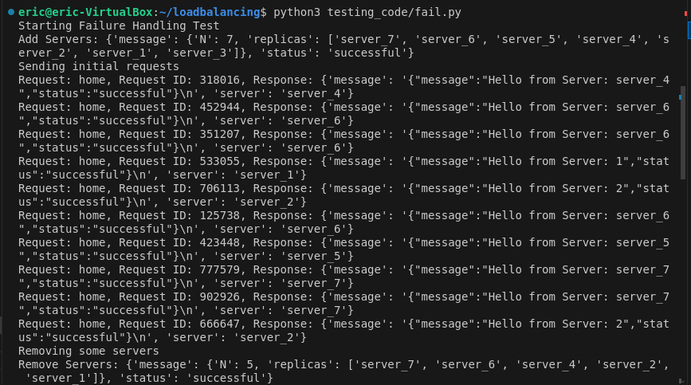

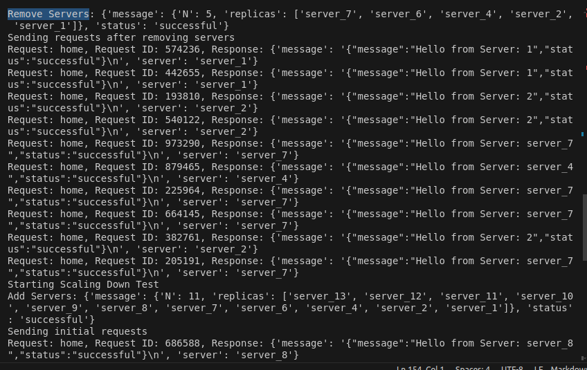

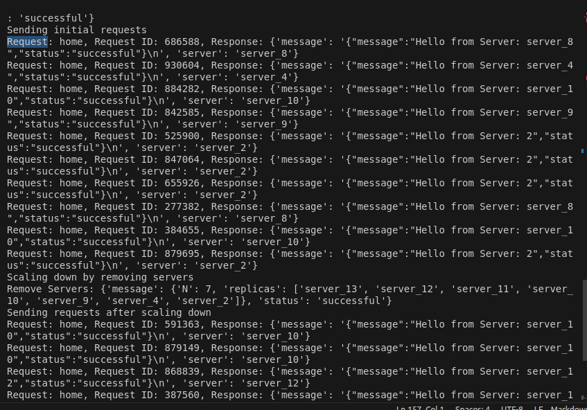

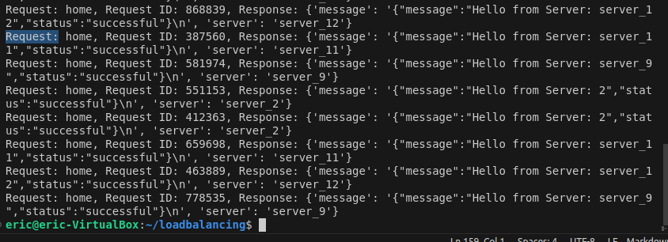

#### Initial Requests with addition of 4 Servers

- **server_4**: 1 request
- **server_6**: 3 requests
- **server_1**: 1 request
- **server_2**: 2 requests
- **server_5**: 1 request
- **server_7**: 2 requests

#### Post-Failure Requests with deletion of 2 Servers

- **server_1**: 2 requests
- **server_2**: 3 requests
- **server_7**: 4 requests
- **server_4**: 1 request

**Observations**:
- The load balancer quickly detected the removal of 2 servers and redistributed the load.
- The response times remained stable, indicating efficient handling of server failures.

### Scaling Down Test

#### Initial Requests with addition of 6 Servers

- **server_8**: 2 requests
- **server_4**: 1 request
- **server_10**: 2 requests
- **server_9**: 1 request
- **server_2**: 4 requests

#### Post-Scaling Requests with removing 2 Servers

- **server_10**: 2 requests
- **server_12**: 2 requests
- **server_11**: 2 requests
- **server_9**: 2 requests
- **server_2**: 3 requests

**Observations**:
- The load balancer effectively scaled down when deletion of 2 servers.
- The load distribution post-scaling was balanced, and the system maintained the performance.

### Testing Load balancing for A-4 modifing the hash and virtual server functions using md5

**A-1 Load Distribution Among 3 Servers**
#### Observations

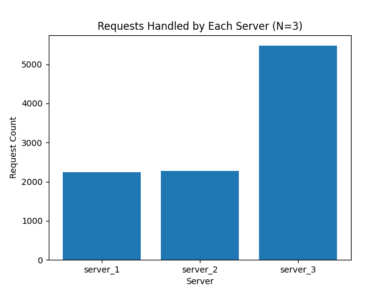

#### Analysis

- The MD5 hash function resulted in an imbalanced load distribution among the servers, with one server handling a significantly higher number of requests.
- The load distribution with the MD5 hash function is less balanced compared to the original SHA-256 based hash function.
- This imbalance indicates that the MD5 hash function might not be as effective in distributing requests evenly across servers.

**A-2 Scalability with Incrementing Servers N from 2 to 6**
#### Observations

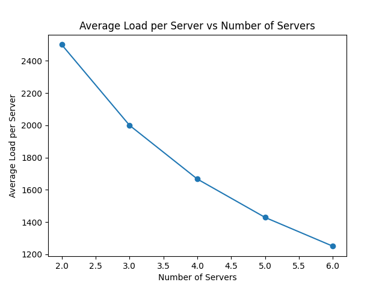

#### Analysis

- The average load per server decreases as the number of servers increases, indicating good scalability.
- Despite the imbalances observed in A-1, the system scales well with the MD5 hash function, distributing the load across an increasing number of servers.
